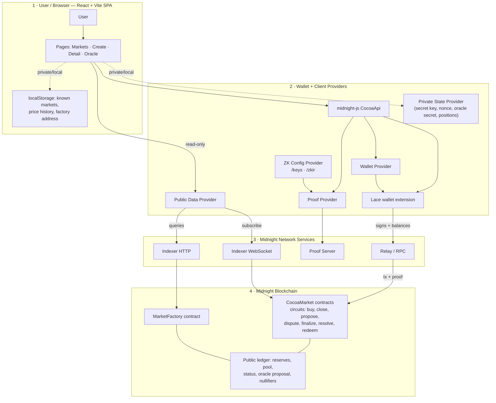

# cocoa.monster — Architecture

cocoa.monster is a **privacy-first prediction market dapp on [Midnight](https://midnight.network)**.
Bet on real-world events — elections, crypto prices, sports — where individual
positions, amounts, and identities stay private through zero-knowledge proofs,
while market prices and resolutions remain publicly verifiable.

There is **no backend**. The whole application is a static React + Vite SPA that
talks directly to a browser wallet, the Midnight network, and (optionally) IPFS.


> The diagram above is rendered by GitHub. A text-based fallback (Mermaid) and the
> exact prompt used to generate the image are in the [Appendix](#appendix-diagram-source).

---

## The four zones

The system splits cleanly into the four horizontal zones shown in the diagram.

### 1. User / Browser

A React 19 + Vite single-page app. No server-side rendering, no API server.

| Page | Route | Purpose |
| --- | --- | --- |
| Markets | `/` | Discover markets (factory registry + local), browse by category |
| Market Detail | `/m/:address` | View live state, place bets, claim winnings, read/post comments |
| Create Market | `/create` | Deploy a new `CocoaMarket` (requires wallet) |
| Oracle / Factory | `/oracle` | Deploy or inspect the shared `MarketFactory` |
| Oracle Market | `/oracle/:address` | Close a market and run resolution (optimistic or trusted) |

**Browser local storage** (no server, so the browser is the source of truth for UX state):

| Key | Contents |
| --- | --- |
| `cocoa.knownMarkets` | Markets the user has seen/created (`KnownMarket[]`, with category + `addedAt`) |
| `cocoa.marketFactoryAddress` | Browser-local factory override (falls back to `VITE_MARKET_FACTORY_ADDRESS`) |
| `cocoa_price_history_<address>` | Per-market price chart history (last 200 ticks) |
| `cocoa.identity` | Device-local P-256 keypair + handle for IPFS comments |
| `cocoa.wallet.disconnected` (sessionStorage) | Skip wallet auto-reconnect for this session |

### 2. Wallet + Client Providers

The browser connects to the **Lace** wallet extension through
`window.midnight.connect(networkId)` (Lace connector API 4.x). All on-chain
interaction goes through a set of midnight-js providers assembled in
`ui/src/lib/providers.ts`:

| Provider | Responsibility | Talks to |
| --- | --- | --- |
| **Wallet Provider** | coin/encryption public keys, transaction balancing | Lace |
| **Private State Provider** | secret key, position nonce, oracle secret, owned positions | Browser LevelDB (scoped to wallet `coinPublicKey`) |
| **Public Data Provider** | reads contract ledger state, subscribes to updates | Indexer HTTP + WebSocket |
| **Proof Provider** | builds ZK proofs for circuit calls | Proof Server (via Lace, or HTTP client) |
| **ZK Config Provider** | serves prover keys + ZK IR per circuit | SPA's own `/keys` and `/zkir` (S3 fallback for builtin Zswap keys) |

A read-only provider set (no wallet, no private state) backs anonymous
browsing of market state via `useReadOnlyMarketState`.

### 3. Midnight Network Services

| Service | Used for |
| --- | --- |
| **Indexer HTTP** (`/api/v4/graphql`) | Factory discovery, point-in-time contract state |
| **Indexer WebSocket** (`/api/v4/graphql/ws`) | Live market state subscription (RxJS `state$`) |
| **Proof Server** | Generates the ZK proofs that accompany each transaction |
| **Network Relay / RPC** | Submits balanced, proven transactions to the chain |

Endpoints are presets selected by `VITE_NETWORK_ID` from `midnight-networks.json`
(`preprod`, `preview`, `mainnet`). In **local dev**, the proof-server URI is
rewritten to the SPA's own origin (`/proof-server`) and Vite proxies it to a
Docker proof-server on port `6300` — keeping proving same-origin and CORS-free.

### 4. Midnight Blockchain

Two Compact contracts (`contract/src/*.compact`):

**`MarketFactory`** — a shared on-chain registry so every browser sees the
same markets. One circuit: `registerMarket(address, question, closeTime,
oraclePubKey, createdAt)`. Public ledger: `markets: Map`, `marketAddresses: Set`.

**`CocoaMarket`** — one deployed instance per market. Supports up to 8
independent YES/NO options.

Circuits:

| Circuit | What it does |
| --- | --- |
| `buy` | Buy YES/NO exposure; enforces CPMM invariant; writes a private position commitment |
| `close` | Halt trading after `closeTime` |
| `proposeOutcome` | Optimistic oracle: propose an outcome + dispute window |
| `disputeOutcome` | Flag a proposal as disputed within the window |
| `finalizeOutcome` | Commit an undisputed proposal after the window closes |
| `resolve` | Trusted path: oracle-secret holder resolves directly in one step |
| `redeem` | Prove a winning position, publish a one-shot nullifier, receive payout |

Public ledger (per market): `question`, `resolutionRules`, `resolutionSource`,
`closeTime`, `oraclePubKey`, `status`, `optionCount`, `unresolvedOptionCount`,
`options` (per-option `reserveYes`, `reserveNo`, `pool`, `volume`,
`totalYesStake`, `totalNoStake`, `status`, `outcome`, proposal fields),
`positions: Set`, `nullifiers: Set`.

---

## Text-based diagram (fallback)



Legend: **blue** = read-only state queries · **green** = transaction & proof
flow · **orange dashed** = private/local browser state · **gray** =
deployment/runtime infrastructure.

---

## Key flows

These map to the colored arrows in the diagram.

### Connect

`React SPA → Lace`: the SPA walks `window.midnight`, calls
`connect(networkId)`, and reads back the shielded address, coin/encryption
public keys, and any wallet-recommended indexer/proof-server overrides.

### Discovery (blue — read-only)

`React SPA → Indexer HTTP → MarketFactory`: the home page resolves a factory
address (local override → `VITE_MARKET_FACTORY_ADDRESS`), reads the factory
ledger via the indexer, then queries each market's current state. Local
`knownMarkets` are merged in so created/visited markets always appear.

### Buy (green — transaction & proof)

`Bet Form → CocoaApi → Proof Provider → Proof Server → Lace (sign + balance)
→ Relay/RPC → CocoaMarket`. A fresh `positionNonce` is rotated, the `buy`
circuit is proven, and the resulting private position is appended to
`ownedPositions` in private state. The CPMM keeps `reserveYes * reserveNo = k`;
buying YES grows the NO reserve by the stake and shrinks the YES reserve,
so price floats. A live chart is derived from on-chain reserve deltas streamed
over the Indexer WebSocket.

### Create market (green)

`Create Page → deploy CocoaMarket → register in MarketFactory → save locally`.
An oracle secret is generated (or supplied); `oraclePubKey =
H("cocoa:oracle:" ‖ oracleSecret)` is committed on-chain. The new address is
written to `cocoa.knownMarkets`.

### Oracle resolution (green)

After `close` (only valid once `now ≥ closeTime`), two paths exist:

- **Optimistic**: `proposeOutcome` → optional `disputeOutcome` within the
  window → `finalizeOutcome` after the window if undisputed.
- **Trusted**: the oracle-secret holder calls `resolve`; the circuit recomputes
  `H("cocoa:oracle:" ‖ oracleSecret())` and asserts it equals the on-chain
  `oraclePubKey`, so only the oracle can take this path.

When the last option resolves, the market becomes `RESOLVED`.

### Redeem (green — privacy)

`private position proof → nullifier → payout`. `redeem` reconstructs the
position commitment `H("cocoa:pos:" ‖ sk ‖ nonce ‖ optionId ‖ amount ‖ side)`
from witness data and asserts membership in the on-chain `positions` set. It
then derives a one-shot nullifier `H("cocoa:null:" ‖ …)`, asserts it is unseen,
inserts it, validates the pro-rata payout against `pool`/`volume`, and sends
unshielded NIGHT to the recipient. The nullifier prevents double-claims while
revealing nothing linkable to identity, side, or size.

---

## Privacy model

- **Positions** are committed on-chain as `H(secret, nonce, side, amount)`.
  Identity, side, and size are hidden; there is no per-user on-chain index.
- **Redemption** reveals only a one-shot **nullifier**, unlinkable to the
  original position commitment.
- **Private state** (secret key, position nonce, oracle secret, owned
  positions) lives in browser LevelDB, scoped to the wallet's `coinPublicKey`,
  via midnight-js's `levelPrivateStateProvider`.
- **Comment identity** is a separate device-local P-256 keypair, deliberately
  decoupled from the shielded wallet so public discussion cannot deanonymize
  private positions.

---

## Market discussion (IPFS / Pinata)

Each market has a comment thread stored entirely on IPFS via
[Pinata](https://pinata.cloud) — still no backend. A comment is a small signed
JSON document pinned to Pinata and tagged with the market address; image
attachments are a second pin referenced by CID. The thread is rebuilt
client-side by listing pins for the market, fetching each document through the
gateway, and keeping only those whose P-256 signature verifies. Configured by
`VITE_PINATA_JWT` (+ optional gateway settings); omit the JWT to hide the panel.

---

## Deployment topology

### Local development

```
Browser ──> Vite dev server (5173) ──/proof-server──> Docker proof-server (6300)
                     │
                     └── serves SPA + /keys + /zkir (synced from contract/managed)
Browser ──> public Midnight indexer / relay for VITE_NETWORK_ID (default: preview)
```

`overmind` (driven by the `Procfile`) runs two processes: `proof` (`docker
compose up proof-server`) and `ui` (`cd ui && npm run dev`). See
[SETUP.md](SETUP.md).

### Production

```
nginx static SPA on Kubernetes (Helm: charts/cocoa-monster)
  ├── runtime config injected as /env.js  (ConfigMap → window.__COCOA_MONSTER_CONFIG__)
  ├── SPA fallback to index.html; /healthz for probes
  ├── /keys and /zkir return 404 for builtin Zswap circuits (intentional fallback)
  └── optional self-hosted proof-server (own Deployment + CORS ingress)
```

The container image is built reproducibly with Nix
(`nix build .#docker-image`, see `nix/`), bundling the compiled Compact
bindings and the Vite `dist/`. Because the bundle is static, `VITE_NETWORK_ID`
and `VITE_MARKET_FACTORY_ADDRESS` are loaded by the **browser at runtime** from
`/env.js` rather than baked at build time.

CI (`.github/workflows/ci.yml`) runs everything through the Nix flake:
`nix flake check`, then `nix run .#{compact,typecheck,build,cypress}`. A
Concourse pipeline (`ci/`) handles image build/publish and chart deploy.

---

## Repository layout

```
cocoa-monster/
├── contract/           Compact contracts (cocoa, factory) + witnesses + client API
├── ui/                 React + Vite SPA (Dockerfile-less; image built via Nix)
├── tools/              deploy-factory.mjs (headless, idempotent factory deployer)
├── charts/             Helm chart for Kubernetes deployment
├── ci/                 Concourse pipeline (fly/ytt/repipe)
├── nix/                Compact toolchain, UI bundle, docker image derivations
├── flake.nix           Nix dev shell + reproducible build apps
├── justfile            Task runner (install, compact, dev, test, down, clean)
├── Procfile            Overmind processes (proof + ui)
├── docker-compose.yml  Local proof-server (midnightntwrk/proof-server:8.0.3)
└── midnight-networks.json   Network presets (preprod / preview / mainnet)
```

---

## Appendix: diagram source

The architecture image is hosted as a GitHub user-attachment and rendered
inline above. If that link ever rots, use the Mermaid diagram in
[Text-based diagram](#text-based-diagram-fallback), or regenerate the image
with the prompt below.

<details>
<summary>Image generation prompt</summary>

```
Create a clean 16:9 architecture diagram titled "cocoa.monster Architecture".

Subject: cocoa.monster is a privacy-first prediction market dapp on Midnight.

Use a modern flat vector style, readable typography, sharp lines, dark charcoal
background, white cards, cocoa/yellow accents, and colored arrows. Avoid
decorative mascots or cartoons. Keep labels short and legible.

Layout the diagram in 4 horizontal zones:

1. User / Browser
- User
- React + Vite SPA
- Pages: Markets, Create Market, Market Detail, Oracle
- Browser local storage: known markets, price history, factory address

2. Wallet + Client Providers
- Lace wallet extension
- midnight-js CocoaApi
- Wallet Provider
- Private State Provider: secret key, nonce, oracle secret, owned positions
- Public Data Provider
- Proof Provider
- ZK Config Provider: /keys and /zkir artifacts

3. Midnight Network Services
- Midnight Indexer HTTP
- Midnight Indexer WebSocket
- Proof Server
- Network Relay / RPC

4. Midnight Blockchain
- MarketFactory contract
- CocoaMarket contracts
- Compact ZK circuits: buy, close, propose, dispute, finalize, resolve, redeem
- Public ledger: reserves, pool, status, oracle proposal, nullifiers

Show these arrows:
- React SPA connects to Lace via window.midnight connect(networkId)
- React SPA reads market discovery from MarketFactory through Indexer HTTP
- React SPA subscribes to live market state through Indexer WebSocket
- Buy flow: Bet Form → CocoaApi → Proof Provider → Proof Server → Lace
  signs/balances → Relay/RPC → CocoaMarket
- Create market flow: Create Page → deploy CocoaMarket → register in
  MarketFactory → save locally
- Oracle flow: close → propose/dispute/finalize OR trusted resolve with
  oracle secret
- Redeem flow: private position proof → nullifier → payout
- ZK artifacts served by the SPA into the proof process
- Local dev: Vite dev server proxies /proof-server to Docker proof-server on
  port 6300
- Production: nginx static SPA on Kubernetes with runtime env.js config and
  optional proof-server ingress

Use arrow colors:
- Blue = read-only state queries
- Green = transaction and proof flow
- Orange dashed = private/local browser state
- Gray = deployment/runtime infrastructure

Add a small legend in the bottom right. Make the diagram professional,
concise, and presentation-ready.
```

</details>
